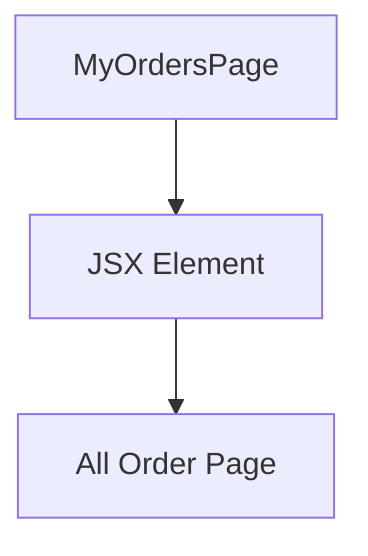

# Introduction

This document will walk you through the "new-order-page" implementation.

The "new-order-page" is designed to display a list of all orders for a user.

We will cover:

1. The structure of the file.
2. The working of the component.
3. A mermaid diagram to illustrate the structure.

# File structure

The file <SwmPath>[src/pages/my_orders.tsx](/src/pages/my_orders.tsx)</SwmPath> contains the <SwmToken path="/src/pages/my_orders.tsx" pos="1:4:4" line-data="export function MyOrdersPage() {">`MyOrdersPage`</SwmToken> component. This component is responsible for rendering the "All Order Page" view.

# Component working

<SwmSnippet path="/src/pages/my_orders.tsx" line="1">

---

The <SwmToken path="/src/pages/my_orders.tsx" pos="1:4:4" line-data="export function MyOrdersPage() {">`MyOrdersPage`</SwmToken> function returns a simple JSX structure that displays a static text "All Order Page". This is a placeholder for the actual order list that will be implemented in the future.

```
export function MyOrdersPage() {
    return (
        <>
            <div>
                All Order Page
            </div>

        </>

    )
}
```

---

</SwmSnippet>

# Mermaid diagram

Below is a mermaid diagram illustrating the structure of the <SwmToken path="/src/pages/my_orders.tsx" pos="1:4:4" line-data="export function MyOrdersPage() {">`MyOrdersPage`</SwmToken> component:



This diagram shows that the <SwmToken path="/src/pages/my_orders.tsx" pos="1:4:4" line-data="export function MyOrdersPage() {">`MyOrdersPage`</SwmToken> component directly returns a JSX element containing a <SwmToken path="/src/pages/my_orders.tsx" pos="4:2:2" line-data="            &lt;div&gt;">`div`</SwmToken> with the text "All Order Page".

<SwmMeta version="3.0.0" repo-id="Z2l0aHViJTNBJTNBZnJlaWdodGZveC1mcm9udGVuZCUzQSUzQWF5b29zaFM=" repo-name="freightfox-frontend"><sup>Powered by [Swimm](https://app.swimm.io/)</sup></SwmMeta>
