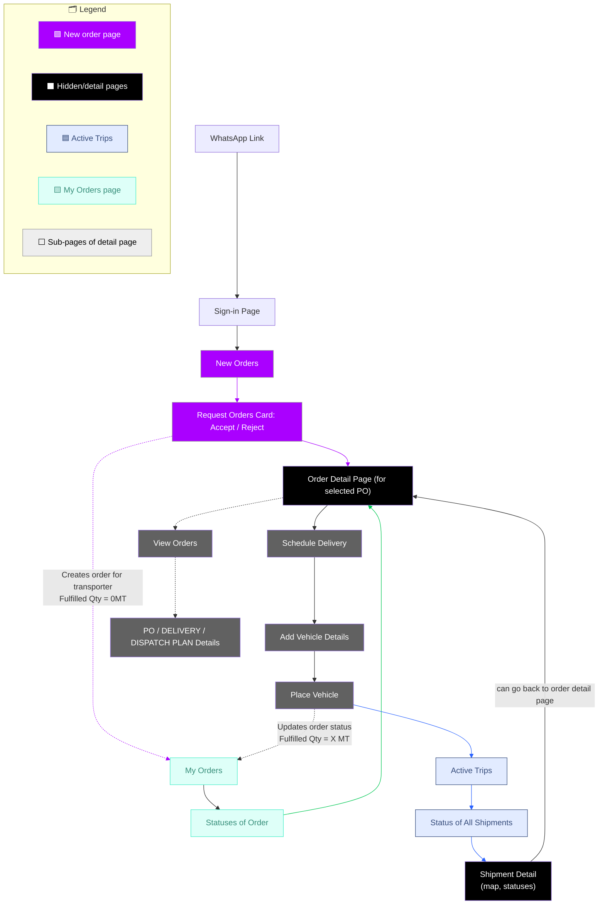

# 📦 FreightFox Frontend

Frontend for FreightFox — a lightweight Transporter Management System (TMS) built with React, TypeScript, and Vite.

## Overview

This repo is structured as an MVP-first development system.  
Each feature or flow lives in its own feature branch with its own README.

## Tech Stack

- React + Vite  
- TypeScript  
- Tailwind CSS + ShadCN UI

## MVP Branches (In Progress)

- `mvp/feature/auth-flow` → phone number + OTP login  
📚 Feature Docs: - [Auth Flow](https://github.com/ayooshS/freightfox-frontend/blob/mvp/feature/auth-flow/README.auth-flow.md)

- `mvp/feature/dashboard` → transporter shipment overview

## High-Level User flow

