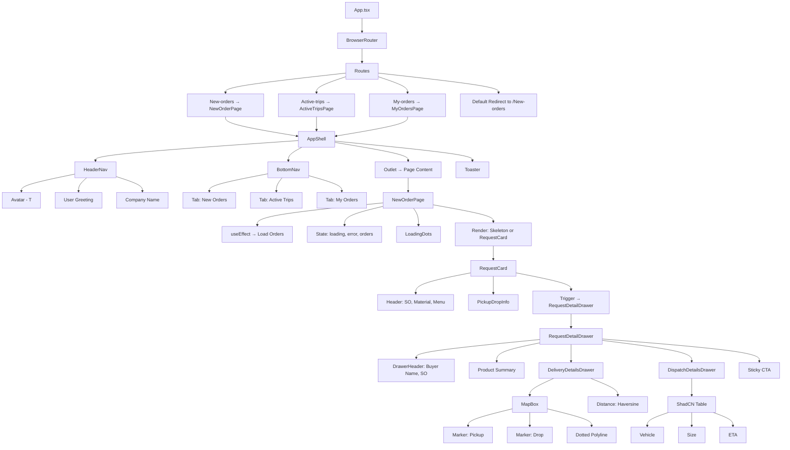
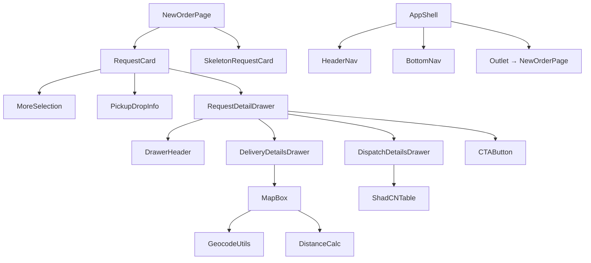
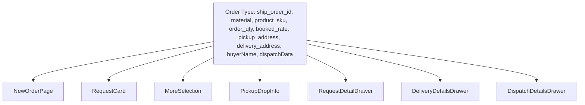
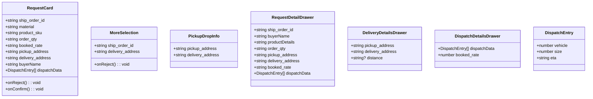

# 📦 New Orders Page – Component Architecture

This document outlines the structure, data model, and component hierarchy for the **New Orders Page** in the FreightFox frontend app.

---

## 🔧 Overview

- Built using **React + TypeScript**
- Mobile-first layout wrapped with `AppShell`
- Modular component-based UI with loading state, data cards, and action handlers
- Uses `react-router-dom` for routing and `sonner` for toast notifications

---

## 📁 Directory Structure

```plaintext
src
├── components
│   ├── Navigation
│   │   ├── BottomNavigation.tsx
│   │   └── header_navigation.tsx
│   ├── NewOrders
│   │   ├── Drawer
│   │   │   ├── delivery_dets_drawer.tsx       // Contains map + dynamic distance
│   │   │   ├── dispatch_dets_drawer.tsx       // ShadCN table showing dispatch info
│   │   │   └── request_order_drawer.tsx       // Parent drawer with summary, delivery, and dispatch
│   │   ├── map
│   │   │   └── map_box.tsx                    // Leaflet map renderer with dotted polyline
│   │   ├── more_selection.tsx                 // Popover menu for reject action
│   │   ├── pickup_drop_info.tsx               // Compact address badges used in collapsed card
│   │   ├── request_card.tsx                   // Expanded card component with confirm CTA
│   │   └── skeleton_request_card.tsx          // Loading skeleton UI
│
├── lib
│   ├── calculateDistance.ts                   // Haversine formula
│   ├── extractCityState.ts                    // Splits address to city+state
│   ├── geocode.ts                             // Calls Nominatim API
│   └── utils.ts
│
├── pages
│   ├── New_order.tsx                          // Main page: fetches order list
│   ├── active_trips.tsx
│   └── my_orders.tsx

├── ui
│   └── AppShell.tsx                           // Layout shell with header, tabs, and outlet

├── SignInForm

```


---

## 🌐 1. Architecture (App Structure + Navigation)



---

## 🧭 1. Page-to-Component Structure



#### Explanation:

- `NewOrderPage` orchestrates data fetching and renders child UI components
- `RequestCard` is the core UI unit rendered per order
- `AppShell wraps` the entire layout with consistent header and bottom navigation
- `RequestDetailDrawer` now branches into 3 key segments:
  - `DeliveryDetailsDrawer` → handles geocoding, distance, and map
  - `DispatchDetailsDrawer` → renders the dispatch plan using a ShadCN table
  - `CTAButton` → sticky action button for Accept & Continue
- `MapBox` now clearly connects to:
  - `GeocodeUtils` → from `lib/geocode.ts` & `extractCityState.ts`  
  - `DistanceCalc` → from `lib/calculateDistance.ts`

---

## 📦 2. Shared Data Model



#### Order Object Shape:

```ts
// lib/types.ts

type DispatchEntry = {
  vehicle: number
  size: number
  eta: string
}

type Order = {
  ship_order_id: string
  material: string
  product_sku: string
  order_qty: string
  booked_rate: string
  pickup_address: string
  delivery_address: string
  buyerName: string
  dispatchData: DispatchEntry[]
}

```
#### Usage:
- Shared across `NewOrderPage` and all its child components
- Passed via props to maintain stateless component design

---

## 🔌 3. Component Interfaces (Props)


---

### ✅ Highlights
- 🧱 Modular component design with clean separation of layout, data cards, and drawers
- 📦 Data-driven architecture using a consistent Order type across all UI layers
- 🔄 Seamless UX flow with loading skeletons, toast notifications, and error boundaries
- 📍 Map integration using Leaflet with pickup/drop markers and dashed polyline
- 🧮 Dynamic distance calculation using Haversine formula from lat/lng
- 📋 Dispatch plan visualization via ShadCN Table with scroll-safe, mobile-optimized layout
- ✨ Reusable utilities like extractCityState, geocodeAddress, and calculateDistance for clean side-effect handling

---

### 🚀 (Future Roadmap)
- 🔗 Integrate real API using fetchOrders or TanStack Query for paginated, cache-friendly data fetching
- 🚫 Add Empty State UI when no orders are available
- 🔍 Implement filters (e.g., by material, buyer, route length)
- 📄 Add SO Detail Page to view order-specific timeline, logs, and route tracking
- 📱 Enable swipe-to-reject or pull-to-refresh gestures on mobile
- 🏷 Replace product string with chip-style product tags
- 📦 Integrate transport/dispatch analytics per vehicle or material type
- 🔐 Add role-based visibility on actions like "Accept & Continue" or "Reject"


