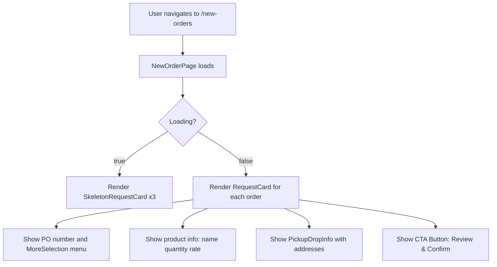

# 📦 New Orders Flow – FreightFox Frontend

This branch `mvp/feature/new-orders` implements the **New Orders UI flow** for the FreightFox frontend. It introduces a modern, skeleton-enhanced interface for handling incoming purchase orders.

---

## 📄 Overview

- New **page**: `NewOrderPage`
- Modular **UI components**:
  - `RequestCard`
  - `PickupDropInfo`
  - `MoreSelection`
  - `SkeletonRequestCard`
- Built with **TailwindCSS** + `shadcn/ui` skeletons
- Smooth **animated loading state** with dots + skeleton
- Mobile-first responsive layout

---

## 🧠 Component Hierarchy

```plaintext
AppShell / Layout
│
├── HeaderNavigation
│
└── Page: NewOrderPage
    ├── [data fetching & state]
    ├── SkeletonRequestCard (loading state)
    ├── RequestCard (rendered when data is available)
    │   ├── MoreSelection (PO options menu)
    │   ├── Badge (material tag)
    │   ├── PickupDropInfo (pickup & drop addresses)
    │   └── Button (Confirm)
```
## 🔁 The flow




## 📦 Components & Props

### 📄 NewOrderPage.tsx  
Handles state, simulates API data, and renders UI.

**State:**
- `orders: Order[]` – mock data  
- `loading: boolean` – loading state  
- `error: string | null` – error state  

**Logic:**
- Simulates API call with `setTimeout`  
- Displays `SkeletonRequestCard` while loading  
- On success, renders list of `RequestCard`  
- Uses `LoadingDots` for animated header

---

### 📄 `request_card.tsx`

Card component for one purchase order.

#### Props:
```ts
type RequestCardProps = {
  poNumber: string
  material: string
  productName: string
  quantity: string
  rate: string
  pickupAddress: string
  dropAddress: string
  onReject: () => void
  onConfirm: () => void
}
```


