# 📦 New Orders Page – Component Architecture

This document outlines the structure, data model, and component hierarchy for the **New Orders Page** in the FreightFox frontend app.

---

## 🔧 Overview

- Built using **React + TypeScript**
- Mobile-first layout wrapped with `AppShell`
- Modular component-based UI with loading state, data cards, and action handlers
- Uses `react-router-dom` for routing and `sonner` for toast notifications

---

## 🌐 1. Architecture (App Structure + Navigation)


---

## 🧭 1. Page-to-Component Structure

```mermaid
graph TD
  NewOrderPage --> RequestCard
  NewOrderPage --> SkeletonRequestCard
  RequestCard --> MoreSelection
  RequestCard --> PickupDropInfo
  AppShell --> HeaderNav
  AppShell --> BottomNav
  AppShell --> Outlet[Outlet → NewOrderPage]
```



#### Explanation:

- `NewOrderPage` orchestrates data fetching and renders child UI components
- `RequestCard` is the core UI unit rendered per order
- `AppShell wraps` the entire layout with consistent header and bottom navigation

---

## 📦 2. Shared Data Model


#### Order Object Shape:

```ts
type Order = {
  poNumber: string
  material: string
  productName: string
  quantity: string
  rate: string
  pickupAddress: string
  dropAddress: string
}
```
#### Usage:
- Shared across `NewOrderPage` and all its child components
- Passed via props to maintain stateless component design

---

## 🔌 3. Component Interfaces (Props)


---

### ✅ Highlights
- ⛓️ Fully modular and reusable component structure
- 📦 Data-driven architecture with shared `Order` type
- 🔄 Seamless UX with loading state and toast feedback
- 🧼 Easy to extend with PO detail view, filter, or pagination

---

### 🚀 Suggested Improvements (Future Roadmap)
 - Integrate real API via `fetchOrders` hook or TanStack Query
 - Add `Empty State` when `orders.length === 0`
 - Navigate to PO Detail Page on confirm
 - Swipe-to-Reject or Pull-to-Refresh for mobile
 - Add tags instead of single product string


